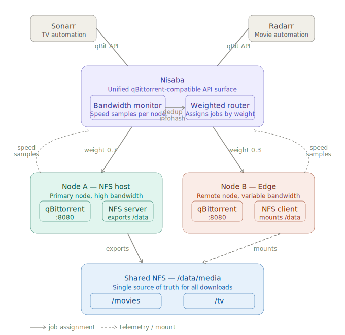
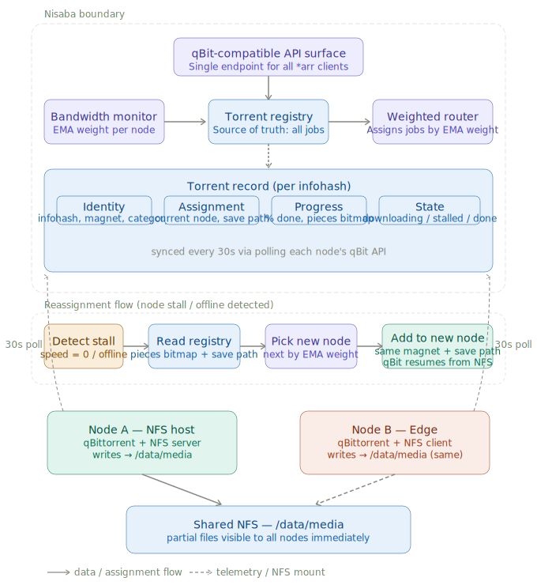
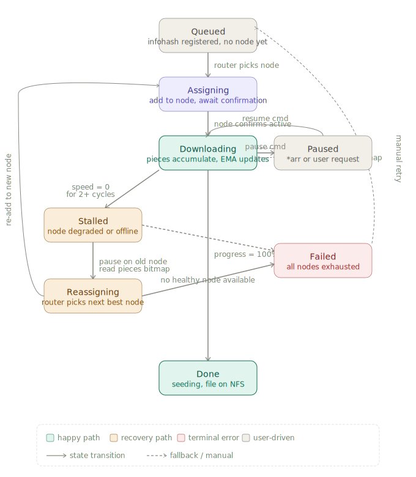
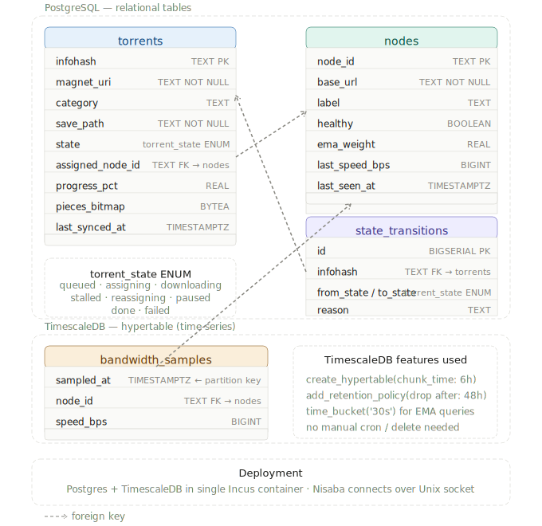
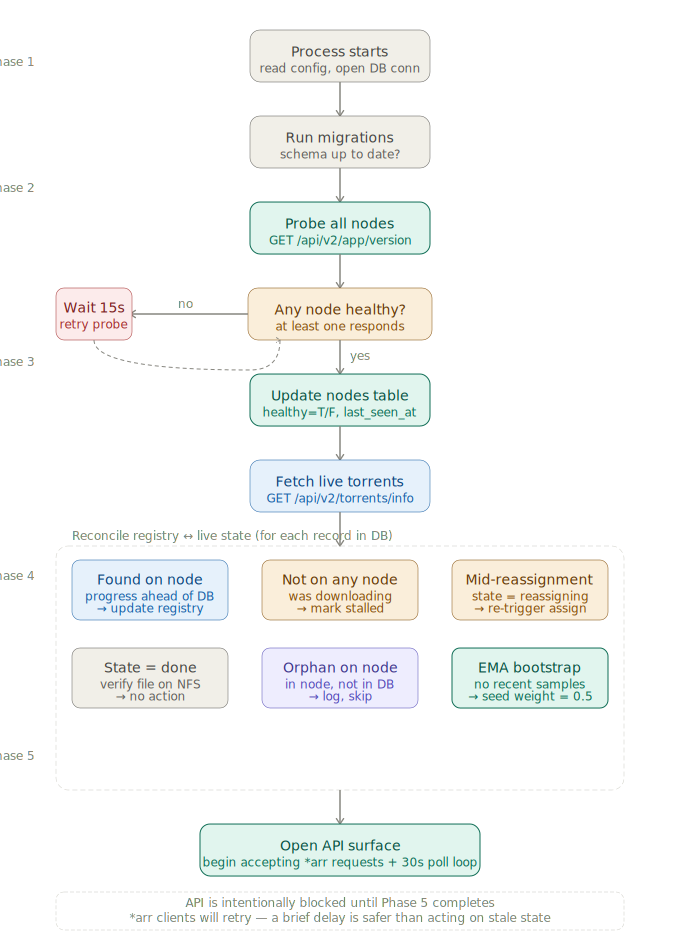

# Nisaba — Architecture Document

**Status:** Design complete, pending two decisions before coding  
**Stack:** Kotlin · Spring Boot 3 · GraalVM Native · PostgreSQL + TimescaleDB  
**Deployment:** Incus container on NFS host node · systemd-managed

> Nisaba was the Sumerian goddess of scribes, grain accounts, and measurement — she kept records, measured quantities, and assigned allocations. The name fits: this service maintains the registry of all download jobs, measures node bandwidth, and assigns work accordingly.

---

## Table of Contents

1. [Problem Statement](#1-problem-statement)
2. [System Overview](#2-system-overview)
3. [Architecture Topology](#3-architecture-topology)
4. [Bandwidth-Weighted Routing](#4-bandwidth-weighted-routing)
5. [Torrent Record State Machine](#5-torrent-record-state-machine)
6. [Persistence — PostgreSQL + TimescaleDB](#6-persistence--postgresql--timescaledb)
7. [Boot and Reconciliation Sequence](#7-boot-and-reconciliation-sequence)
8. [Technology Stack](#8-technology-stack)
9. [Open Decisions Before Coding](#9-open-decisions-before-coding)
10. [Build Order](#10-build-order)

---

## 1. Problem Statement

A self-hosted setup running multiple nodes has one qBittorrent instance per node and one shared NFS volume. The `*arr` stack (Sonarr, Radarr) points at a single torrent client. The goal is to distribute download jobs across all nodes intelligently — giving more work to faster nodes — without the `*arr` stack knowing multiple nodes exist, and without ever downloading the same file twice.

**Core constraints:**

- `*arr` clients talk to one endpoint (Nisaba) using the standard qBittorrent Web API contract
- All nodes mount the same NFS path — files land in the same place regardless of which node downloads them
- If a node stalls or goes offline, its in-progress download must resume on another node from the point it reached, without re-downloading completed pieces
- Nisaba is the single source of truth for all download state

---

## 2. System Overview



Nisaba is the only component with knowledge of the full system. Individual nodes are dumb executors — they run vanilla unmodified qBittorrent.

The key design principle is **shared storage eliminates deduplication complexity.** Because every node writes to the same NFS path, Nisaba only needs to track which node is downloading a job — not where the file ends up. Partial files are visible to all nodes immediately. When a job is reassigned, qBittorrent on the new node scans the existing partial file on NFS, validates pieces, and resumes from the frontier. No custom sync protocol needed.

---

## 3. Architecture Topology



### Components

| Component | Role | Location |
|---|---|---|
| Nisaba | Unified API surface + routing + registry | Incus container, NFS host node |
| Node A (NFS host) | Primary download node, NFS server | Host bare metal or VM |
| Node B+ (Edge) | Additional download nodes, NFS clients | Remote nodes via mesh VPN |
| PostgreSQL + TimescaleDB | Registry + telemetry persistence | Incus container, NFS host node |
| Shared NFS volume | Single `/data/media` mountpoint for all nodes | NFS host storage pool |

### Networking

Nodes reach each other and Nisaba over a **mesh VPN** (e.g. Netbird, Tailscale, or WireGuard). This means edge nodes behind NAT are reachable without port forwarding. Nisaba connects to remote qBittorrent instances over the mesh, not the public internet.

---

## 4. Bandwidth-Weighted Routing

### Sampling

Nisaba polls each node's qBittorrent API every **30 seconds** for current download speed (`dl_info_speed` from `/api/v2/transfer/info`). Each sample is written to the `bandwidth_samples` TimescaleDB hypertable.

### EMA weight calculation

Node weights use an **Exponential Moving Average** with `α = 0.3`:

```
new_weight = 0.3 × current_speed_bps + 0.7 × previous_weight
```

This means:
- Recent performance matters more than historical performance
- A brief speed drop doesn't tank a node's weight permanently
- A sustained drop sheds ~70% of earned weight within ~3 cycles (~90s)
- Weight is persisted to `nodes.ema_weight` — survives Nisaba restarts without cold-starting

### Routing decision

When a new job arrives, the router selects the healthy node with the highest `ema_weight`. If multiple nodes have equal weight, round-robin is used as a tiebreaker.

### EMA cold start

On first boot or after samples age out (>48h), all node weights are seeded at `0.5`. The EMA self-corrects within the first two or three 30-second cycles.

### Deduplication

Before routing any job, Nisaba checks the registry by infohash. If a record already exists (any state), the add is rejected and `ErrAlreadyExists` is returned to the `*arr` client.

---

## 5. Torrent Record State Machine



Every torrent managed by Nisaba has a record in the `torrents` table with a `state` field. State transitions are the only way records move through the system.

### State descriptions

| State | Meaning |
|---|---|
| `queued` | Infohash registered, no node assigned yet |
| `assigning` | Router selected a node, awaiting confirmation from qBit |
| `downloading` | Active on a node, pieces accumulating, synced every 30s |
| `stalled` | Speed = 0 for 2+ consecutive cycles (60s), or node offline |
| `reassigning` | Old node paused, picking next best node by EMA weight |
| `paused` | Explicitly paused by `*arr` or user — excluded from stall detection |
| `done` | Progress = 100%, file on NFS, seeding |
| `failed` | No healthy nodes available during reassignment |

### Reassignment flow detail

1. Stall detected (2 cycles at 0 bps, or node health check fails)
2. Send pause command to old node via qBit API
3. Read `pieces_bitmap` from registry (last 30s sync)
4. Router selects next healthy node by EMA weight
5. Add torrent to new node with same `magnet_uri` + `save_path`
6. qBittorrent on new node scans NFS partial file, validates pieces, resumes
7. Registry updated: `assigned_node_id` → new node, state → `assigning`

The `*arr` client observes nothing — it sees continuous progress from a single endpoint.

### Edge case: simultaneous writes

After reassignment, Nisaba explicitly pauses the torrent on the old node before adding to the new one. This prevents two nodes writing the same pieces to NFS concurrently.

### Key state machine invariants

- The `assigning` state is intentional — if a node rejects the add, the record bounces back to `queued` rather than creating a phantom `downloading` record
- `paused` is orthogonal to the recovery path — stall detection only runs against `downloading` records
- `failed` is not permanent — a manual retry drops the record back to `queued`

---

## 6. Persistence — PostgreSQL + TimescaleDB



### Why this split

Plain PostgreSQL handles all relational data (torrents, nodes, audit log). TimescaleDB is used exclusively for `bandwidth_samples` — a time-series table that benefits from automatic time-based partitioning, fast range queries, and native retention policies. No separate TSDB needed; TimescaleDB runs as a Postgres extension.

### Schema

#### `torrents` — registry core

```sql
CREATE TYPE torrent_state AS ENUM (
  'queued', 'assigning', 'downloading',
  'stalled', 'reassigning', 'paused', 'done', 'failed'
);

CREATE TABLE torrents (
  infohash         TEXT PRIMARY KEY,
  magnet_uri       TEXT NOT NULL,
  category         TEXT,
  save_path        TEXT NOT NULL,
  state            torrent_state NOT NULL DEFAULT 'queued',
  assigned_node_id TEXT REFERENCES nodes(node_id),
  progress_pct     REAL,
  pieces_bitmap    BYTEA,           -- raw bitfield from qBit, used on reassignment
  last_synced_at   TIMESTAMPTZ
);
```

#### `nodes` — pool config + live telemetry

```sql
CREATE TABLE nodes (
  node_id        TEXT PRIMARY KEY,
  base_url       TEXT NOT NULL,     -- e.g. http://node-a.mesh:8080
  label          TEXT,
  healthy        BOOLEAN NOT NULL DEFAULT false,
  ema_weight     REAL NOT NULL DEFAULT 0.5,
  last_speed_bps BIGINT,
  last_seen_at   TIMESTAMPTZ
);
```

#### `state_transitions` — audit log

```sql
CREATE TABLE state_transitions (
  id          BIGSERIAL PRIMARY KEY,
  infohash    TEXT NOT NULL REFERENCES torrents(infohash),
  from_state  torrent_state,
  to_state    torrent_state NOT NULL,
  node_id     TEXT,                 -- snapshot of assigned node at transition time
  reason      TEXT,                 -- e.g. "stall detected: 2 cycles at 0 bps"
  occurred_at TIMESTAMPTZ NOT NULL DEFAULT now()
);
```

#### `bandwidth_samples` — TimescaleDB hypertable

```sql
CREATE TABLE bandwidth_samples (
  sampled_at  TIMESTAMPTZ NOT NULL,   -- partition key
  node_id     TEXT NOT NULL REFERENCES nodes(node_id),
  speed_bps   BIGINT NOT NULL
);

-- Convert to hypertable, partition by 6h chunks
SELECT create_hypertable('bandwidth_samples', 'sampled_at',
  chunk_time_interval => INTERVAL '6 hours');

-- Auto-drop chunks older than 48h
SELECT add_retention_policy('bandwidth_samples', INTERVAL '48 hours');
```

EMA queries use TimescaleDB's `time_bucket('30s', sampled_at)` for bucketed aggregation — no manual cron or DELETE jobs needed.

### Deployment

Postgres + TimescaleDB run in a single Incus container on the NFS host node. Nisaba connects over a Unix socket — fastest possible latency, no TCP overhead, no authentication overhead for local connections.

---

## 7. Boot and Reconciliation Sequence



The API surface is intentionally **blocked until all 5 phases complete**. The `*arr` clients will queue their retries — acting on stale state before reconciliation is a worse failure mode than a brief startup delay.

### Phase 1 — Connect and migrate

- Open Postgres connection pool
- Run schema migrations (additive only)
- Fail fast if DB is unreachable

### Phase 2 — Probe all nodes

- `GET /api/v2/app/version` on each configured node in parallel
- Update `nodes.healthy` and `nodes.last_seen_at`
- If **no nodes** respond: wait 15s, retry. Repeat until at least one node is healthy.

### Phase 3 — Fetch live torrent state

- `GET /api/v2/torrents/info` on all healthy nodes in parallel
- Build an in-memory map of `infohash → (node_id, progress, state)`

### Phase 4 — Reconcile DB vs live state

For every record in the `torrents` table:

| Condition | Action |
|---|---|
| Found on a node, progress ahead of DB | Fast-forward registry: update `progress_pct`, `pieces_bitmap`, `last_synced_at` |
| Not found on any node, state was `downloading` | Mark state → `stalled` (triggers reassignment after API opens) |
| State is `reassigning` in DB | Nisaba crashed mid-handoff — re-trigger assignment from existing `pieces_bitmap` |
| State is `done` | No action |
| Found on node, not in DB (orphan) | Log warning, do not touch — Nisaba only owns what it added |
| `bandwidth_samples` empty (first boot or purged) | Seed all `nodes.ema_weight` to `0.5` |

### Phase 5 — Open API

- Start HTTP server (qBit-compatible API surface)
- Start 30s poll scheduler
- Start node health check loop
- Begin accepting `*arr` requests

---

## 8. Technology Stack

| Concern | Choice | Rationale |
|---|---|---|
| Language | Kotlin | Deep Spring integration, Arrow-kt fits state machine cleanly |
| Framework | Spring Boot 3.x | First-class GraalVM AOT since 3.1, best Kotlin coroutine support |
| Native image | Spring AOT + GraalVM | Comparable startup/memory to Go (~30–80MB), millisecond boot |
| HTTP server | Spring WebMVC (blocking) | Simpler model, sufficient for Nisaba's request volume |
| qBit API client | Spring WebClient | Declarative, coroutines-friendly, non-blocking I/O for node polling |
| Scheduler | Spring `@Scheduled` | Native, no extra dependency |
| Concurrency | Kotlin coroutines | Parallel node probing on boot, natural async model |
| Error handling | Arrow-kt `Either` | Clean separation of node rejection vs network failure vs success |
| Database access | Spring Data JDBC | Simple, explicit SQL, no ORM magic |
| Dev database | Testcontainers `@ServiceConnection` | Auto-spins Postgres+TimescaleDB container in dev |
| Containerisation | Incus | Consistent with standard homelab stack pattern |
| Process management | systemd | Consistent with standard homelab stack pattern |

### Why not Quarkus

Quarkus's advantages (faster native builds, Dev Services auto-DB) are real but marginal for this use case. Spring Boot 3 closed the GraalVM gap in 3.1. Staying on Spring Boot means zero ramp-up cost, better Kotlin coroutine integration, and a consistent programming model if running alongside other Spring Boot services.

### Why not Go

The interceptor has no CPU-intensive work — it is pure I/O (HTTP, Postgres, scheduler). The Kotlin + Spring Boot + Arrow-kt stack handles this equally well. Go remains a better fit for services that manage many concurrent OS-level processes (e.g. FFmpeg workers).

---

## 9. Open Decisions Before Coding

Two decisions will block day-one implementation. The rest can be decided as work progresses.

### Blocking — must decide first

**Decision 1 — Node credential storage**

Nisaba needs a qBittorrent username + password per node.

| Option | Tradeoff |
|---|---|
| Config file (`nodes.yml`) | Simple, readable — credentials in plaintext on disk |
| Environment variables | Slightly better, works well with systemd `EnvironmentFile` |
| Secret manager (e.g. Vaultwarden) | Cleanest operationally if already in the stack |

**Decision 2 — Category → save path mapping**

Sonarr sends `category: tv-sonarr` when adding a torrent. qBittorrent normally maps this to a local save path. Since all nodes share NFS, Nisaba must own this mapping and inject the correct `save_path` on every add.

```yaml
categories:
  tv-sonarr:   /data/media/tv
  radarr:      /data/media/movies
  default:     /data/media/misc
```

### Non-blocking — decide as you go

| Decision | Options |
|---|---|
| `*arr`-facing API auth | Static username/password in config (mirrors real qBit API) |
| Node registration | Static `nodes.yml` for v1, admin POST API later |
| Admin observability | `/health` (do now), `/debug/registry` (useful in dev), Prometheus (later) |
| Completed torrent policy | Leave seeding indefinitely (v1), configurable pause-after-N-hours (later) |
| Nisaba HA | Single instance for v1 — multiple writers need EMA state consensus |
| Backpressure | Not handled in v1 — router assigns even when all nodes are saturated |

---

## 10. Build Order

Each phase produces a runnable, testable artifact. Nothing is built speculatively.

### Phase 1 — Foundation (week 1)

**Goal:** Nisaba boots, connects to DB, talks to one real qBit node.

- Spring Boot 3 project scaffold with GraalVM native profile
- `nodes` table + migration
- Node health check loop (`@Scheduled`, 30s)
- qBittorrent Web API client (WebClient, one node)
- `/health` endpoint
- `bandwidth_samples` hypertable + EMA write

**Done when:** Nisaba starts, marks a real qBit node as healthy, writes speed samples to Postgres.

---

### Phase 2 — Registry core (week 1–2)

**Goal:** Nisaba can receive a torrent add from a real `*arr` client and add it to a node.

- `torrents` table + migration
- `state_transitions` table + migration
- `torrent_state` enum
- `POST /api/v2/torrents/add` handler (qBit API surface)
- Infohash deduplication check
- Routing: pick highest-weight healthy node
- Add torrent to selected node via qBit client
- Record written to registry, state → `assigning` → `downloading`

**Done when:** Radarr adds a movie via Nisaba, torrent appears in the target node's qBittorrent.

---

### Phase 3 — 30s sync loop (week 2)

**Goal:** Registry stays in sync with live node state.

- Poll `GET /api/v2/torrents/info` on all healthy nodes every 30s
- Diff against registry: update `progress_pct`, `pieces_bitmap`, `last_synced_at`
- Detect stalled torrents (2 consecutive 0-speed cycles)
- `GET /api/v2/torrents/info` aggregation endpoint (merges all nodes for `*arr` polling)
- `GET /api/v2/sync/maindata` stub (used by `*arr` for change detection)

**Done when:** Sonarr's Activity tab shows live progress from a torrent downloading on a node.

---

### Phase 4 — Reassignment (week 2–3)

**Goal:** A torrent stalled on Node A automatically resumes on Node B without re-downloading.

- Stall → `Reassigning` transition
- Pause command to old node
- Re-add to new node with same `magnet_uri` + `save_path` from registry
- Verify new node picks up pieces from NFS (qBit recheck)
- `state_transitions` audit log write on every transition
- Arrow-kt `Either` error handling in routing path

**Done when:** Kill qBittorrent on primary node mid-download, verify torrent resumes on edge node from correct offset.

---

### Phase 5 — Boot reconciliation (week 3)

**Goal:** Nisaba restart is safe and self-healing.

- Full Phase 1–4 reconciliation sequence on startup
- API blocked until reconciliation complete
- EMA cold-start seeding
- Orphan detection + logging
- Mid-reassignment crash recovery

**Done when:** Restart Nisaba mid-download, verify no state loss and download continues.

---

### Phase 6 — Config + operability (week 3–4)

**Goal:** Production-ready for daily use.

- `nodes.yml` config with credential loading (from chosen source)
- Category → save path config map
- GraalVM native image build + Incus container packaging
- systemd unit file
- `/debug/registry` endpoint (list all torrent records + states)
- Testcontainers integration test suite (full add → download → reassign flow)

**Done when:** `*arr` stack pointed at Nisaba in production, no manual intervention needed for a week.

---

### Phase 7 — Observability (post-v1)

*Nice to have, not blocking production use.*

- Prometheus metrics endpoint (active torrents per node, EMA weights, reassignment count)
- Admin API for node registration at runtime
- Configurable post-download seeding policy
- Grafana dashboard

---

## Appendix — Key invariants

These must hold at all times and should be enforced by tests:

1. **One active assignment per infohash** — registry must never have two `downloading` records for the same infohash
2. **EMA weight is always in [0, 1]** — router must handle zero-weight nodes gracefully (skip, not divide by zero)
3. **API is blocked during reconciliation** — no request is accepted until Phase 4 completes on boot
4. **Pause before re-add** — Nisaba must pause on old node before adding to new node on reassignment
5. **Nisaba only touches what it added** — orphan torrents on nodes are never modified or removed
